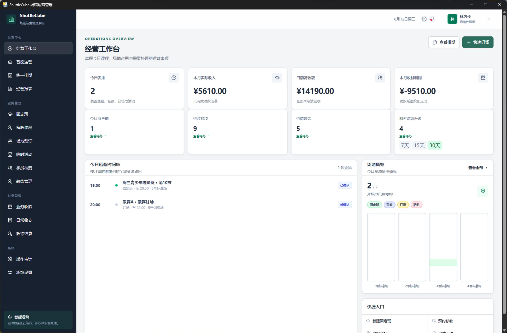
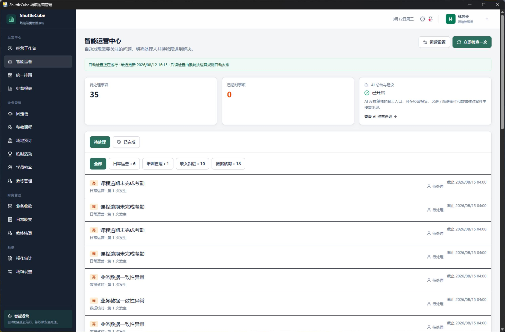
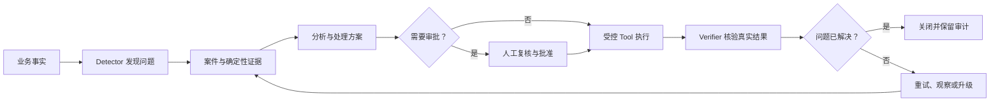

<div align="center">

# ShuttleCube

### 羽毛球场馆经营、培训管理与智能运营系统

**统一管理场地、课程、学员、财务与教练结算，并用可审批、可验证的 Agent 闭环持续发现和处理经营问题。**

[](https://www.python.org/)
[](https://fastapi.tiangolo.com/)
[](https://react.dev/)
[](https://www.typescriptlang.org/)
[](docs/desktop-deployment.md)

[核心能力](#核心能力) · [智能运营](#智能运营不是聊天框) · [快速开始](#快速开始) · [Windows 桌面版](#windows-桌面版) · [项目文档](#项目文档)

</div>

## 界面预览

### 经营工作台

经营指标、待办事项、当日排期和场地占用集中呈现，帮助负责人快速掌握场馆状态。



### 智能运营中心

系统主动发现异常并形成运营案件，按日常运营、培训管理、收入跟进和数据核对分类持续跟踪。



## 项目定位

ShuttleCube 面向羽毛球馆的日常经营与培训业务，当前适合单场馆、本地部署或小规模服务器部署。系统覆盖统一排期、固定班、私教、考勤、订场、活动、收退款、课时权益、教练工资和经营报表。

智能运营助手不是独立聊天机器人。它建立在真实业务数据和现有业务服务之上，遵循以下闭环：

> 主动发现问题 → 展示证据与建议 → 受控业务处理 → 必要时人工审批 → 确定性验证 → 持续跟踪直至关闭

即使没有配置大模型，核心业务、经营指标计算、异常检测、案件流转和结果核验仍可正常运行；大模型只用于解释、总结与建议。

## 核心能力

| 领域 | 当前能力 |
| --- | --- |
| 经营工作台 | 今日安排、收入与待收款、收付利润、待考勤、待结教练、即将结束班级、场地概览 |
| 统一排期 | 固定班、私教、订场和临时活动统一展示，并检查场地、教练与学员冲突 |
| 培训管理 | 固定班、学员报名、课时台账、考勤、请假、课程取消与补排、续费 |
| 私教管理 | 私教课包、权益余额、约课、消课、续费和相关应收 |
| 场地经营 | 场地资源、营业时间、订场、临时活动及利用情况 |
| 财务管理 | 应收、收款、退款、其他收入、日常支出、付款凭证和业务对象关联 |
| 教练结算 | 固定班与私教课时费用、按月汇总、确认与结算 |
| 智能运营 | 逾期考勤、欠费与续费、取消课程补排、业务数据一致性等案件的发现和闭环处理 |
| 经营报告 | 指定日、周、月生成确定性经营快照、异常提示，以及可选的 AI 总结和运营建议 |
| 审计与设置 | 操作审计、场馆资料、资源目录、运营规则、AI 服务和本地数据管理 |

## 智能运营不是聊天框



### 确定性程序与 LLM 的边界

| 由确定性程序负责 | 由 LLM 负责 |
| --- | --- |
| 金额、数量、课时、余额、利用率和报表指标计算 | 对已计算指标进行解释和总结 |
| 排期冲突、异常条件、案件状态和截止时间 | 提炼异常重点和可能原因 |
| 权限、场馆范围、参数校验和业务约束 | 在允许的上下文中给出运营建议 |
| 审批、幂等执行、重试、恢复与结果核验 | 生成满足 Schema 且带证据引用的结构化内容 |

模型没有任意 SQL 或数据库修改权限，也不能成为资金、权益、排期和案件状态的最终裁决者。

### 受控执行机制

- Tool Registry 为每个工具声明输入输出、风险等级、所需权限、审批要求、幂等边界和 Verifier。
- 高风险操作冻结方案、规则版本、输入哈希与影响快照；审批后执行前再次检查权限、时效和业务对象版本。
- Agent Runtime 使用数据库 checkpoint、lease、重试和预算限制持久化运行状态。
- 请求结果不明确时优先对账真实业务记录，避免盲目重试已经成功的写操作。
- Trace 和审计记录覆盖案件、运行步骤、审批、Tool 调用、验证结果及模型使用情况。

## 技术架构

ShuttleCube 采用模块化单体架构，优先复用同一套领域模型、业务服务和权限边界，避免为 Agent 引入不必要的分布式基础设施。

```text
React 19 + TypeScript + Vite + TanStack Query
                         │
                         ▼
                  FastAPI REST API
                         │
       ┌─────────────────┼─────────────────┐
       │                 │                 │
  业务命令/查询    Operations Kernel   Model Adapters
                  Detector / Case     OpenAI / DeepSeek
                  Workflow / Tool     Compatible API
                  Approval / Verifier
       └─────────────────┼─────────────────┘
                         │
                 SQLAlchemy + Alembic
                         │
           PostgreSQL（服务端）/ SQLite（桌面端）
```

| 层级 | 技术选型 |
| --- | --- |
| Web 前端 | React 19、TypeScript 5.8、Vite、React Router、TanStack Query、Tailwind CSS |
| API 与领域层 | Python 3.14、FastAPI、Pydantic、SQLAlchemy 2、Alembic |
| Agent Runtime | 显式状态机、数据库 checkpoint/lease、Tool Registry、审批与 Verifier |
| AI Provider | OpenAI Responses API、DeepSeek Chat Completions、自定义 OpenAI 兼容服务 |
| 数据与附件 | PostgreSQL / SQLite、本地文件 / S3 兼容对象存储 |
| Windows 交付 | pywebview、PyInstaller、Inno Setup、Windows DPAPI |
| 质量保障 | pytest、Vitest、React Testing Library、Playwright、Ruff、ESLint |

## 快速开始

### 环境要求

- Python 3.14
- [uv](https://docs.astral.sh/uv/)
- Node.js Active LTS
- pnpm 10

### 安装依赖

```powershell
pnpm.cmd install
uv sync --project backend
```

### 启动开发环境

在项目根目录打开两个 PowerShell 窗口。

后端（自动执行数据库迁移，默认使用 `backend/shuttlecube.db`）：

```powershell
powershell -ExecutionPolicy Bypass -File scripts/start-backend.ps1
```

前端：

```powershell
pnpm.cmd --dir frontend dev --port 5174
```

浏览器访问 [http://localhost:5174](http://localhost:5174)。全新数据库会进入首次初始化向导，用于创建场馆和管理员。

如需为已有管理员初始化首位智能运营负责人，在 `backend` 目录执行：

```powershell
uv run shuttlecube bootstrap-operations-owner --username <登录用户名>
```

完整启动和初始化说明见 [start.md](start.md)。

### Docker Compose

```bash
docker compose up --build
```

默认入口为 [http://localhost:8080](http://localhost:8080)。Compose 会启动 PostgreSQL、S3 兼容对象存储、后端、前端和 Nginx；默认凭据只用于本地开发。

## Windows 桌面版

桌面版将 React 前端、FastAPI 本地服务和 SQLite 一起封装，最终用户无需安装 Python、Node.js 或数据库服务。

从源码运行：

```powershell
pnpm.cmd install
uv sync --project backend --extra desktop
pnpm.cmd --dir frontend build
$env:SHUTTLECUBE_DATA_DIR = Join-Path (Get-Location) ".desktop-dev-data"
uv run --project backend shuttlecube-desktop
```

构建 Windows 安装包：

```powershell
powershell -ExecutionPolicy Bypass -File scripts/build-desktop.ps1 -Installer
```

安装后的业务数据默认保存在 `%LOCALAPPDATA%\ShuttleCube\Data`。构建、升级、备份和凭据存储边界见 [桌面部署说明](docs/desktop-deployment.md)。

## AI 服务配置

管理员可在“场馆设置 → AI 服务设置”中选择 OpenAI、DeepSeek 或自定义兼容服务，填写 API Key 和模型名称，验证连接后再单独启用 AI。

- AI 默认关闭，不影响确定性运营能力。
- Windows 桌面版使用当前用户的 DPAPI 加密 API Key，凭据不进入业务数据库和数据迁移包。
- 模型上下文会过滤密钥、Cookie、联系方式、附件地址和未授权财务字段。
- 模型调用失败时自动降级，不阻塞核心业务和确定性报告。

## 验证与测试

```powershell
# 前端类型检查与构建
pnpm.cmd --dir frontend typecheck
pnpm.cmd --dir frontend build

# 后端代码检查
uv run --project backend ruff check backend/src backend/tests

# 智能运营核心回归
pnpm.cmd test:operations:core

# 完整后端测试（按需）
uv run --project backend pytest
```

涉及真实模型调用的测试使用 `live_model` 标记，默认不应放入普通离线 CI。

## 项目结构

```text
ShuttleCube/
├── backend/                 # FastAPI、领域模型、Operations Kernel、迁移与测试
│   └── src/shuttlecube/
│       ├── api/             # REST API、认证、Scope 与权限边界
│       ├── application/     # Commands、Queries 与 Agent Workflow
│       ├── domain/          # 领域模型、状态和业务约束
│       └── infrastructure/  # 数据库、AI、附件、桌面与安全适配器
├── frontend/                # React 管理端与桌面端界面
├── desktop/                 # PyInstaller 与 Inno Setup 配置
├── e2e/                     # Playwright 端到端测试
├── scripts/                 # 开发、构建、演示数据和维护脚本
├── specs/                   # Spec Kit 规格、计划、数据模型和接口契约
└── docs/                    # 部署、运行手册与架构说明
```

## 安全边界

- Organization / Venue Scope 在 API、业务查询、Agent Context 和 Tool 层保持一致。
- capability 必须由服务端校验，前端隐藏按钮不构成安全边界。
- 高风险写操作保留人工审批、幂等控制、执行前重检和执行后核验。
- 模型不能绕过权限、审批、规则版本或业务 Service 直接修改数据。
- 审计记录与业务数据采用相同的组织、场馆隔离边界。

## 项目文档

- [项目启动说明](start.md)
- [智能运营 Spec](specs/002-intelligent-operations/spec.md)
- [智能运营实现计划](specs/002-intelligent-operations/plan.md)
- [智能运营运行手册](docs/intelligent-operations-runbook.md)
- [Windows 桌面部署说明](docs/desktop-deployment.md)
- [智能运营助手项目总结与演进建议](docs/智能运营助手Agent项目总结与演进建议.md)
- [角色权限演进方案](docs/角色权限演进方案.md)

## 当前状态

项目当前处于可运行的 MVP / 深化开发阶段，已具备主要场馆业务流程、智能运营工作区、确定性经营报告和 Windows 桌面交付能力。现阶段重点是完善真实场馆验证、离线 Agent Eval、关键业务 E2E、运行可观测性和多场馆配置体验。

暂未将以下能力作为当前已交付范围：集团级多场馆运营后台、面向消费者的订场小程序、自动外呼或短信营销、开放式任意 SQL Agent、通用知识库 RAG，以及为展示概念而拆分的多 Agent、Kafka、Temporal 或 Kubernetes 架构。

---

<div align="center">

ShuttleCube · 让场馆运营问题从“被看见”走向“被解决”

</div>
