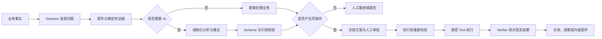

<div align="center">

# ShuttleCube

### 面向羽毛球场馆的智能运营与业务管理系统

**用确定性程序守住业务事实，用 AI 提升运营判断与处理效率。**

[](https://www.python.org/)
[](https://fastapi.tiangolo.com/)
[](https://react.dev/)
[](https://www.typescriptlang.org/)
[](https://www.postgresql.org/)
[](docs/desktop-deployment.md)

[核心能力](#核心能力) · [Agent 架构](#agent-不是聊天框而是可控业务闭环) · [快速开始](#快速开始) · [桌面版](#windows-桌面版) · [技术架构](#技术架构)

</div>

---

## 项目定位

ShuttleCube 不是一个套在管理系统外面的 AI 聊天框，而是一套覆盖场馆日常经营的完整业务系统，并在真实业务事实之上构建了**案件驱动、可审批、可恢复、可审计**的智能运营 Agent。

系统覆盖排期、固定班、私教、考勤、订场、活动、收退款、课时权益、教练工资和经营报表，并能够持续发现欠费、续费、逾期考勤、课程补排和数据对账等运营问题。普通业务由确定性程序计算，AI 只负责适合语言模型的解释、归纳与建议；即使没有配置模型，核心业务和运营检测仍可独立运行。

> 设计目标：让场馆负责人在一个界面里发现问题、理解证据、完成处理并验证结果，而不是在多个页面之间寻找线索。

## 核心能力

| 领域 | 已实现能力 |
|---|---|
| 场馆经营 | 场地资源、营业时间、统一排期、订场、临时活动与利用率 |
| 课程业务 | 固定班、私教课包、学员权益、续费、请假、取消、补排与考勤 |
| 财务闭环 | 应收、收款、退款、其他收入、支出、凭证与业务对象关联 |
| 教练结算 | 费率快照、课酬生成、月度结算、锁定与结算支出 |
| 智能运营 | 自动扫描、案件去重、确定性证据、负责人处理、状态机与结果核验 |
| 经营分析 | 日/周/月确定性快照、异常识别、AI 总结与指标引用校验 |
| 规则治理 | 规则草稿、命名、复制、编辑、激活、查看、删除和版本追踪 |
| 桌面交付 | Windows 单机安装、SQLite、本地附件、数据导入导出与加密凭据 |

## Agent 不是聊天框，而是可控业务闭环



### 确定性内核与模型职责分离

金额、课时、排期冲突、案件状态、异常判断和结果核验由普通业务代码负责。模型不能直接访问数据库，也不能成为资金、权益或业务状态的最终裁决者。

### Human-in-the-loop

高风险操作不会因为模型给出建议就直接执行。系统冻结候选方案、规则版本、输入哈希和影响快照，经过人工审批后再检查权限、有效期、对象版本和资源冲突。业务事实已经变化时，原审批会失效并要求重新生成方案。

### 受控 Tool Registry

每个工具都声明输入/输出 Schema、风险等级、所需 capability、审批要求、幂等边界、超时策略和 Verifier。模型无法创建任意工具，也不能绕过场馆 Scope、权限或审批机制。

### 可恢复 Runtime

Agent 运行过程使用数据库 checkpoint、lease 和预算限制持久化。写操作具有幂等键；当请求超时但结果未知时，系统优先根据真实业务记录对账，而不是盲目重试可能已经成功的操作。

### 结构化模型输出

系统支持 OpenAI Responses API、DeepSeek Chat Completions 和自定义 OpenAI 兼容服务。模型输出经过 Pydantic Schema 校验；经营报告中的数字通过 `metric_ref` 引用服务端确定性指标，避免模型随意编造经营数据。

## 代表性运营场景

- 自动发现欠费、续费机会和即将到期的课程权益；
- 识别课程逾期未考勤，并在案件内直接打开对应考勤窗口；
- 为已取消课程生成合法补排候选，经审批后执行并核验结果；
- 检查资金、课时、工资和排期之间的数据一致性；
- 生成经营快照、异常说明及带有生成进度反馈的 AI 总结；
- 保存案件处理记录，支持关闭后历史查询和重复问题追踪。

## 技术架构

```text
React 19 + TypeScript + TanStack Query
                  │
                  ▼
        FastAPI Modular Monolith
  ┌───────────────┼────────────────┐
  │               │                │
业务命令/查询   Operations Kernel   Model Adapters
  │          Detector / Case /      OpenAI
  │          Workflow / Tool /      DeepSeek
  │          Approval / Verifier    Compatible API
  └───────────────┼────────────────┘
                  │
          SQLAlchemy + Alembic
                  │
       PostgreSQL 17 / SQLite Desktop
```

| 层级 | 技术选型 |
|---|---|
| Web 前端 | React 19、TypeScript 5.8、Vite、TanStack Query、React Router、Tailwind CSS |
| API 与领域层 | Python 3.14、FastAPI、Pydantic、SQLAlchemy 2、Alembic |
| Agent Runtime | 显式状态机、数据库 checkpoint/lease、Tool Registry、审批与 Verifier |
| AI Provider | OpenAI、DeepSeek、自定义 OpenAI 兼容服务 |
| 数据存储 | PostgreSQL 17（服务器版）、SQLite（桌面版）、本地/S3 附件 |
| 桌面交付 | pywebview、PyInstaller、Inno Setup、Windows DPAPI |
| 质量保障 | pytest、Vitest、React Testing Library、Playwright、Ruff、ESLint |

## 安全与可靠性边界

- Organization / Venue Scope 在 API、业务查询、Agent Context 与 Tool 中保持一致；
- capability 在服务端校验，前端隐藏按钮不是安全边界；
- API Key 在 Windows 桌面版中使用当前用户 DPAPI 加密，不进入数据库或迁移包；
- 模型默认关闭，保存并验证 API Key 不会自动启用 AI 服务；
- Trace 和模型上下文会过滤密钥、Cookie、联系方式、附件地址及未授权财务字段；
- 高风险外部写操作必须保留人工确认、幂等控制和执行后核验；
- 模型不可用时自动降级，确定性运营能力保持可用。

## 快速开始

### 环境要求

- Node.js Active LTS 与 pnpm
- Python 3.14 与 [uv](https://docs.astral.sh/uv/)
- PostgreSQL 17（服务器模式）或 SQLite（桌面模式）
- Windows 桌面模式需要 WebView2

### 浏览器开发模式

在项目根目录分别启动后端和前端：

```powershell
powershell -ExecutionPolicy Bypass -File scripts/start-backend.ps1
```

```powershell
pnpm.cmd --dir frontend dev --port 5174
```

更完整的依赖安装、迁移、首次负责人初始化与桌面调试说明见 [start.md](start.md)。

### Docker Compose

```bash
docker compose up --build
```

默认入口为 `http://localhost:8080`。Compose 配置会启动 PostgreSQL、对象存储、API、前端与 Nginx，默认凭据仅用于本地开发。

## Windows 桌面版

桌面版把 React 前端、FastAPI 本地服务和 SQLite 一起封装，不要求最终用户安装 Python、Node.js 或数据库服务。

### 从源码直接调试

```powershell
pnpm.cmd install
uv sync --project backend --extra desktop
pnpm.cmd --dir frontend build
$env:SHUTTLECUBE_DATA_DIR = Join-Path (Get-Location) ".desktop-dev-data"
uv run --project backend shuttlecube-desktop
```

### 构建 Windows 安装包

```powershell
powershell -ExecutionPolicy Bypass -File scripts/build-desktop.ps1 -Installer
```

安装后的业务数据默认位于：

```text
%LOCALAPPDATA%\ShuttleCube\Data
├── database\shuttlecube.db
├── attachments\
├── backups\
└── settings\
```

完整构建、数据迁移和凭据边界见 [桌面部署说明](docs/desktop-deployment.md)。

## AI 服务配置

桌面版可在“场馆设置 → 资源目录 → AI 服务设置”中完成：

1. 选择 OpenAI、DeepSeek 或自定义兼容服务；
2. 配置 API Key、模型名称和可选服务地址；
3. 验证连接，确认凭据有效；
4. 独立决定是否启用 AI 服务。

AI 只增强案件分析与经营报告总结，不是使用核心业务功能的前提。

## 项目结构

```text
ShuttleCube/
├── backend/                 # FastAPI、领域模型、Operations Kernel 与迁移
│   ├── src/shuttlecube/
│   │   ├── api/             # REST API 与权限边界
│   │   ├── application/     # Commands、Queries 与 Agent Workflow
│   │   ├── domain/          # 领域模型与状态约束
│   │   └── infrastructure/  # 数据库、AI、桌面与安全适配器
│   └── tests/
├── frontend/                # React 管理端与桌面端界面
├── desktop/                 # PyInstaller 与 Inno Setup 配置
├── e2e/                     # Playwright 端到端测试
├── scripts/                 # 开发、构建和数据工具
├── specs/                   # 功能规格、数据模型与接口契约
└── docs/                    # 部署、运行手册与设计文档
```

## 设计取舍

当前实现是一个模块化单体中的智能运营内核，而不是为了展示技术名词拆出的多 Agent 系统。项目也没有把实时业务数据放进向量数据库：金额、课时和排期更适合受权限控制的确定性查询。只有在未来接入制度、合同和运营手册等非结构化知识时，RAG 才具有明确价值。

这一取舍让系统在单场馆和 Windows 单机交付场景中保持更低的部署成本，同时保留 Scope、状态机、持久化 Runtime 和 Provider Adapter 等可扩展边界。

## 当前状态与路线

项目已具备可运行的核心业务闭环、智能运营工作区和 Windows 桌面交付能力。下一阶段重点不是继续堆叠 Agent 名称，而是补强：

- 可重复的离线 Agent Eval 与模型版本对比；
- Run、Token、审批、Tool 和案件效果的可观测面板；
- 从问题发现到业务处理完成的智能运营 E2E 演示；
- 欠费追回、续费转化和人工处理时长等业务效果指标。

更多技术分析见 [智能运营助手 Agent 项目总结与演进建议](docs/智能运营助手Agent项目总结与演进建议.md)。

---

<div align="center">

**ShuttleCube — Reliable operations before autonomous operations.**

</div>
