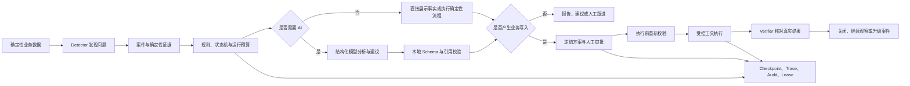

# ShuttleCube 智能运营助手：Agent 技术总结、求职价值与演进建议

> 评估日期：2026-08-12
> 评估口径：以当前代码、接口、测试和可运行桌面版为准；规划但尚未实现的能力不会计入现状。

## 1. 结论先行

ShuttleCube 的智能运营助手已经不只是“给业务系统接一个大模型”。它具备一个可靠业务 Agent 的主要骨架：确定性发现问题、形成案件、按版本化规则运行、调用受控模型生成解释或建议、由工具注册表限制能力、对写操作进行人工审批、执行后再次验证，并保留运行与审计记录。

作为求职项目，它有较好的含金量，尤其适合以下岗位：

- AI Agent 应用工程师 / AI 应用后端工程师；
- Python / FastAPI 后端工程师；
- AI 全栈工程师；
- 工作流、自动化、企业软件或垂直 SaaS 方向的工程师。

它对“算法研究岗”的帮助相对有限，因为项目重点是 Agent 工程、安全执行和业务闭环，而不是模型训练、微调或算法创新。

综合评价：**当前可作为一项 7.5/10 左右的 Agent 应用作品**。架构深度明显高于普通聊天机器人或简单工具调用 Demo；如果补齐离线 Eval、完整端到端演示、运行观测和真实业务效果指标，作品集说服力可以提升到 **8.5/10 以上**。

需要准确表述的是：当前是“一个智能运营 Agent 内核承载多个业务工作流”，不是多 Agent 协作系统。没有必要为了简历强行包装成多 Agent。

## 2. 当前 Agent 的业务闭环

目前已覆盖的代表性业务包括：

- 欠费与续费机会发现、案件分析和结构化跟进记录；
- 固定班和私教课包续费提醒；
- 课程逾期未考勤发现，并在案件内打开对应考勤窗口处理；
- 已取消课程的补排候选生成、人工审批、执行和结果核验；
- 资金、课时、工资、排期等一致性对账异常；
- 日、周、月经营报告的确定性快照、异常识别和 AI 总结建议；
- 运营规则的命名、草稿、复制、激活、查看、编辑和删除等版本管理。

## 3. 已实现的 Agent 技术亮点

### 3.1 确定性内核与大模型职责分离

金额、课时、状态、排期冲突、异常判断和案件关闭由普通业务代码计算；模型主要用于解释、归纳和建议。即使没有配置 API Key 或关闭 AI，案件扫描、验证和确定性经营报告仍能工作。

这是项目最重要的设计亮点。它减少了模型幻觉对真实业务的影响，也说明开发者理解“LLM 不应该成为资金、权益和状态的最终裁判”。

代码证据：[`detectors.py`](../backend/src/shuttlecube/application/operations/detectors.py)、[`verifiers.py`](../backend/src/shuttlecube/application/operations/verifiers.py)、[`reports.py`](../backend/src/shuttlecube/application/operations/reports.py)。

### 3.2 案件驱动，而不是一次性问答

业务异常会形成可持续跟进的 `OperationCase`，具备类型、严重程度、证据、负责人、出现次数和状态。相同问题通过 fingerprint 去重；业务事实变化后更新同一案件，处理完成后由 Verifier 关闭，并保留历史记录。

这比“用户问一次、模型答一次”的聊天模式更接近真正的企业自动化 Agent。

代码证据：[`cases.py`](../backend/src/shuttlecube/application/operations/cases.py)、[`models.py`](../backend/src/shuttlecube/domain/operations/models.py)、[`state_machine.py`](../backend/src/shuttlecube/application/operations/state_machine.py)。

### 3.3 严格的 Tool Registry 与最小权限

每个工具明确声明：

- 输入和输出 Schema；
- 风险等级；
- 所需 capability；
- 是否需要人工确认或强制审批；
- 幂等范围、超时、脱敏和 Verifier；
- 是否允许模型选择。

模型不能创建任意工具、修改工具风险等级、提交浏览器提供的 Venue Scope，也不能直接访问 SQL、Shell、文件系统或任意 URL。

代码证据：[`tools.py`](../backend/src/shuttlecube/application/operations/tools.py)、[`access.py`](../backend/src/shuttlecube/application/operations/access.py)。

### 3.4 Human-in-the-loop 审批闭环

课程补排不是模型说“执行”就执行。服务端先生成合法候选并冻结输入、影响快照、规则版本和业务对象版本；审批时检查权限、有效期和输入哈希；真正执行前再次检查营业时间、课程版本、教练、场地和资源冲突。

如果业务事实或运营规则已经变化，审批会变为 stale，要求重新生成方案。这是企业 Agent 中非常有价值的并发安全和审批设计。

代码证据：[`replacement_workflow.py`](../backend/src/shuttlecube/application/operations/replacement_workflow.py)、[`approvals.py`](../backend/src/shuttlecube/application/operations/approvals.py)、[`replacement_executor.py`](../backend/src/shuttlecube/application/operations/replacement_executor.py)。

### 3.5 幂等、结果对账与不确定状态处理

写工具具有幂等键和输入哈希，同一幂等键不能执行不同内容。当执行过程可能已经提交但客户端未收到结果时，系统不会盲目重试，而是先通过真实业务记录进行 outcome reconciliation，再判断成功、未执行或结果不确定。

这比只做“失败后重试三次”成熟得多，尤其适用于排课、支付、权益等不能重复写入的场景。

代码证据：[`idempotency.py`](../backend/src/shuttlecube/application/operations/idempotency.py)、[`replacement_executor.py`](../backend/src/shuttlecube/application/operations/replacement_executor.py)。

### 3.6 可恢复的持久化 Runtime

运行过程不是只放在内存里，而是持久化 `OperationRun`、checkpoint、步骤次数、模型调用次数、工具调用次数和 Token 用量。后台 Runner 使用数据库 lease 领取任务，支持租约到期后的接管，并限制最大步骤、模型调用、工具调用和写调用。

它展示了对长流程恢复、成本边界和任务并发的理解，同时仍保持模块化单体，没有为了“Agent”引入不必要的分布式基础设施。

代码证据：[`runtime.py`](../backend/src/shuttlecube/application/operations/runtime.py)、[`runner.py`](../backend/src/shuttlecube/application/operations/runner.py)。

### 3.7 结构化模型输出与数值引用校验

OpenAI 使用 Responses API 结构化输出；DeepSeek 和自定义兼容服务使用 Chat Completions，并在本地用 Pydantic 验证 JSON。经营报告中的 AI 文本不能任意编造数字，而是使用 `metric_ref` 引用服务端已计算指标，再由服务端渲染。

模型输出不符合 Schema、引用不存在或内容越界时会被拒绝，确定性报告仍然可用。

代码证据：[`openai_client.py`](../backend/src/shuttlecube/infrastructure/ai/openai_client.py)、[`report_narrative.py`](../backend/src/shuttlecube/application/operations/report_narrative.py)、[`revenue_workflow.py`](../backend/src/shuttlecube/application/operations/revenue_workflow.py)。

### 3.8 多供应商适配与本地凭据保护

项目支持 OpenAI、DeepSeek 和自定义 OpenAI 兼容地址，并区分 Responses 与 Chat Completions 协议。桌面版 API Key 使用 Windows 当前用户加密保存，连接验证成功与“启用 AI”是两个独立动作，避免仅配置密钥就自动发送数据。

代码证据：[`credentials.py`](../backend/src/shuttlecube/infrastructure/ai/credentials.py)、[`model_client.py`](../backend/src/shuttlecube/application/operations/model_client.py)。

### 3.9 Scope、脱敏、Trace 与业务审计

Organization/Venue Scope、capability、模型上下文、工具结果和前端字段使用同一套权限边界。Trace 会隐藏密钥、Cookie、联系方式、附件地址以及无权查看的财务或工资字段；业务写入还会关联既有 AuditLog。

这让项目具有企业应用需要的数据隔离和可追溯性，而不是只在前端隐藏按钮。

代码证据：[`tracing.py`](../backend/src/shuttlecube/application/operations/tracing.py)、[`access.py`](../backend/src/shuttlecube/application/operations/access.py)。

### 3.10 Agent 与业务界面形成闭环

案件详情不再只给出模糊链接。逾期考勤等事项能够在当前案件页面打开对应业务抽屉，并带入课程、时间、学员和当前案件信息；AI 分析和经营报告也具有明确的生成中状态。

这体现了 Agent 产品设计能力：用户关心的是“在这里把事情处理完”，而不是看 Agent 输出一段文字后自己寻找业务入口。

前端证据：[`case-action-drawer.tsx`](../frontend/src/features/intelligent-operations/case-action-drawer.tsx)、[`case-detail-page.tsx`](../frontend/src/features/intelligent-operations/case-detail-page.tsx)、[`report-page.tsx`](../frontend/src/features/intelligent-operations/report-page.tsx)。

## 4. 当前项目不应过度包装的地方

### 4.1 不是多 Agent 系统

当前是多个业务工作流共享同一套运行内核、工具和模型适配器。它没有独立的规划 Agent、财务 Agent、排课 Agent 之间的协商、消息传递或任务委派。

这不是缺陷。对当前场馆规模而言，确定性工作流通常比多 Agent 更简单、便宜、稳定。面试时可以强调“根据问题复杂度主动避免无必要的多 Agent 架构”。

### 4.2 不是通用自然语言运营助手

目前 AI 的主要入口是案件分析、经营报告总结和部分异常解释，不是任意提问式对话，也没有会话记忆。若岗位特别强调 Conversational Agent、Memory 或开放式 Tool Calling，需要补充对应作品证据。

### 4.3 没有结构化数据 RAG，也没有必要强加

金额、排期和课时应该实时查询，不适合向量检索。当前没有 RAG 是合理选择。未来只有在接入规章制度、合同、退款政策和运营手册等非结构化知识时，RAG 才能产生真实价值。

### 4.4 Eval 和端到端证据仍不完整

当前具备较好的单元、契约和集成测试，但还缺少成熟的离线模型评测集、提示注入回归、不同模型版本对比和智能运营完整 Playwright 流程。仓库已有普通业务 E2E，用于智能运营的完整端到端作品证据仍需补齐。

### 4.5 缺少真实生产效果

目前能证明系统“设计和运行正确”，但还不能证明它实际减少了多少人工时间、追回多少欠款、提升多少续费率或降低多少漏考勤。求职项目如果能加入可量化的模拟实验或真实试用数据，说服力会明显增强。

## 5. 求职含金量分析

| 维度 | 当前水平 | 面试价值 |
|---|---|---|
| 业务完整度 | 高 | 不是孤立 AI Demo，而是排课、考勤、财务、工资和运营案件的完整垂直系统 |
| Agent 架构 | 中高 | 有工作流、工具、审批、Verifier、Runtime 和降级，不依赖框架堆砌 |
| 安全与可靠性 | 高 | Scope、权限、脱敏、幂等、版本、审批和审计都能展开讲 |
| 模型工程 | 中 | 有结构化输出、多供应商和引用校验，但缺少系统化 Eval 与模型对比 |
| 全栈产品能力 | 高 | 从 API、数据库、桌面凭据到案件内交互形成闭环 |
| 生产化证据 | 中 | 有测试和恢复设计，但缺少真实流量、效果指标、告警和长期运行数据 |
| 算法研究价值 | 低至中 | 没有训练、微调或新算法，重点不在研究 |

最值得面试展开的不是“使用了哪个模型”，而是以下问题：

1. 为什么让确定性代码决定金额、状态和合法性，而让模型只负责解释与建议？
2. 如何防止模型越权调用工具或绕过审批？
3. 用户审批后业务数据变了怎么办？
4. 写操作超时，但不知道是否已经成功时，为什么不能直接重试？
5. 模型失败、API Key 缺失或输出非法时，业务如何继续工作？
6. 为什么当前没有使用 LangGraph、向量数据库或多 Agent？什么条件下才值得引入？

能够结合真实代码回答这些问题，含金量远高于只展示一次 function calling。

## 6. 最值得新增的业务与技术能力

以下建议同时考虑业务价值、Agent 技术展示度和当前架构可复用程度。

### P0：优先补齐作品证据和可运营性

#### 6.1 Agent Eval 评测与发布门禁

建立固定中文评测集，至少覆盖：

- 正常欠费、续费、考勤、补排、报表和对账案例；
- 缺少数据、相互矛盾数据、历史记录和过期方案；
- 提示注入、越权财务请求、要求跳过审批、要求执行任意 SQL/HTTP；
- 模型返回非法 JSON、错误引用、编造数字和超长输出；
- OpenAI、DeepSeek 和自定义供应商的兼容性回归。

建议指标：Schema 通过率、数字引用正确率、越权工具拒绝率、幻觉率、任务完成率、平均 Token、P95 延迟和单次成本。模型、Prompt、Schema 或 Tool 版本变化时自动对比基线。

这项改进对业务的价值是降低模型升级风险；对求职的价值是证明具备 LLMOps/Eval 能力。它应当是下一阶段最高优先级。

#### 6.2 Agent 运行观测和成本面板

增加管理端观测页，展示：

- Run 成功、失败、重试、等待人工和平均耗时；
- 各工作流模型调用量、Token、成本和缓存命中；
- Tool 调用、审批通过率、stale 率和执行失败率；
- Detector 命中数、案件关闭率、平均处理时长和超期数；
- Provider 错误率和最近一次健康状态。

同时增加结构化日志、错误告警和 trace_id 检索。当前已有持久化数据基础，主要工作是聚合查询和可视化。

#### 6.3 智能运营完整 E2E 演示

补充一条可重复演示的完整流程：生成假数据 → 自动发现逾期考勤 → 案件内完成考勤 → Verifier 关闭案件；再补一条：取消课程 → 生成补排候选 → 审批 → 执行 → 审计与案件关闭。

这能把后端可靠性转化成招聘者几分钟内可看懂的作品证据。建议同时准备 3～5 分钟录屏和一页架构图。

### P1：形成更强的经营闭环

#### 6.4 客户跟进任务与通知闭环

当前系统能发现欠费/续费并记录跟进，但还可以增加：

- 明确的下一次跟进时间、提醒和逾期升级；
- 用户确认后的微信/短信/邮件草稿；
- 对外发送前的收件人、内容、隐私和频率确认；
- 发送结果、客户回复和后续案件状态；
- 联系频率限制和退订机制。

技术亮点包括外部连接器、异步回调、幂等发送、人工审批和失败补偿；业务上可以直接衡量欠款追回率和续费转化率。

首版可以只做“生成草稿 + 人工复制/确认”，不要直接自动群发。

#### 6.5 续费与流失风险分层

使用确定性特征形成可解释风险评分，例如剩余课时、有效期、近期出勤、请假/缺席、跟进结果、欠费和课程结束时间。模型只负责把已计算特征转成容易理解的原因和沟通建议。

先使用规则或简单统计基线，收集真实反馈后再评估机器学习模型。需要记录建议是否采用、是否续费以及实际金额，形成可评估的反馈闭环。

#### 6.6 场地利用优化和候选方案模拟

增加闲时识别、未来 7/14 天利用率预测和“如果调整时段/价格会怎样”的只读模拟：

- 识别持续低利用时段；
- 给出调班、体验课、企业包场或促销候选；
- 计算场地、教练、学员和营业时间约束；
- 展示预期收入、影响范围和不确定性；
- 默认只生成方案，不自动改价或改课。

它能同时展示约束求解、业务模拟和 Agent 解释能力，比单纯生成营销文案更有技术含量。

#### 6.7 管理者每日简报与闭环指标

在现有案件和经营报告之上形成真正的“今天先做什么”：

- 昨日未完成事项；
- 今日高优先级案件及原因；
- 即将到期的审批和跟进；
- 经营指标异常；
- 昨日 Agent 帮助完成的操作与节省时间估算。

简报中的数字继续引用确定性快照；每条建议必须能直接进入案件处理抽屉。

### P2：有明确需求后再扩展

#### 6.8 非结构化制度知识 RAG

仅用于退款规则、场馆制度、教练合同、活动方案和操作手册。需要实现文档权限、版本、引用页码、过期提示、提示注入隔离和“制度建议不替代业务规则”。不要把实时余额、应收和排期放入向量库。

#### 6.9 事件驱动和实时进度

当外部通知、长任务或多门店并发出现后，再考虑独立 Worker、队列和 SSE/WebSocket。当前数据库轮询 Runner 对单场馆桌面版是合理设计，不应仅为技术名词提前引入 Redis、Celery 或 Kafka。

#### 6.10 有边界的多 Agent 协作

只有当单一流程确实出现相互独立的复杂领域时，再拆分为：

- 运营协调 Agent：拆解目标、合并结果，不直接写业务；
- 财务分析 Agent：只读受授权的财务快照；
- 排课规划 Agent：只处理候选方案和冲突；
- 客户跟进 Agent：只生成沟通计划和草稿；
- Compliance/Verifier：确定性校验，不应由另一个 LLM 冒充。

所有 Agent 仍通过同一 Tool Registry、Scope、预算和审批边界。多 Agent 的价值应由任务成功率或维护成本证明，而不是为了增加架构复杂度。

## 7. 推荐实施路线

### 迭代一：可评测、可观测、可演示

1. 建立 50～100 条固定 Eval 样例和评分器；
2. 增加 Agent 运行、Token、成本、审批和案件效果面板；
3. 补齐两条智能运营 Playwright 完整流程；
4. 准备一键演示数据、架构图和录屏。

这是对求职价值提升最大的一轮。

### 迭代二：欠费/续费跟进闭环

1. 跟进任务、提醒和结果状态；
2. AI 沟通草稿与人工确认；
3. 采用/拒绝反馈；
4. 追回金额、续费金额、转化率和平均处理时间指标。

### 迭代三：经营优化

1. 续费/流失风险分层；
2. 闲时与场地利用分析；
3. 约束下的候选方案和收益模拟；
4. 对照基线评估建议是否真正有用。

### 迭代四：外部连接和规模化

1. 经审批的消息、邮件或日历连接器；
2. 回调、幂等、重试和补偿；
3. 多门店数据隔离与汇总；
4. 达到真实并发需求后再拆独立 Worker。

## 8. 应持续衡量的指标

### 业务指标

- 欠费案件追回金额和追回率；
- 续费建议采用率、续费转化率和续费金额；
- 逾期考勤发现率和平均关闭时间；
- 补排方案采用率、补排成功率和人工操作步数；
- 案件平均处理时间、超期率和重复打开率；
- 场地利用率和低利用时段改善；
- 每周节省的人工处理时间。

### Agent 质量指标

- Detector 精确率与漏报率；
- Verifier 错误关闭率；
- 模型输出 Schema 通过率；
- 数字/事实引用正确率；
- 越权请求和提示注入阻断率；
- 建议采用率与人工修改率；
- Tool 成功率、stale 率、重复副作用数；
- Run 成功率、P50/P95 耗时、Token 和成本；
- 模型不可用时确定性功能可用率。

没有这些指标，项目只能证明“做了 Agent”；有了这些指标，才能证明“Agent 对业务有效且可安全运营”。

## 9. 简历与面试表述建议

### 30 秒项目介绍

ShuttleCube 是一个面向羽毛球场馆的桌面/Web 经营管理系统。我在完整的排课、考勤、收款、课时和工资业务之上实现了案件驱动的智能运营 Agent：确定性规则负责发现问题和核验结果，大模型只做结构化解释与建议；所有工具经过权限、风险、审批、幂等和版本控制，写操作执行后还会基于真实业务记录再次验证。系统支持 OpenAI、DeepSeek 和自定义兼容模型，模型关闭时核心运营能力仍可独立运行。

### 可用于简历的要点

- 设计并实现案件驱动的智能运营 Agent，将欠费、续费、逾期考勤、课程补排和业务对账统一为可追踪、可验证的运营工作流。
- 构建强类型 Tool Registry 和 Human-in-the-loop 审批机制，结合 capability、输入哈希、业务版本、幂等键与执行前重校验，阻止越权、过期和重复副作用。
- 实现基于数据库 checkpoint/lease 的可恢复 Agent Runtime，支持预算限制、失败降级、租约接管、结果对账和 Trace/Audit 关联。
- 接入 OpenAI Responses、DeepSeek Chat Completions 和自定义兼容服务，通过 Pydantic Schema、指标引用和敏感字段脱敏约束模型输出。
- 使用 FastAPI、SQLAlchemy、React、TanStack Query 构建案件内业务处理闭环，同时支持 PostgreSQL 服务端和 SQLite Windows 桌面版。

简历中不要写“训练了智能运营模型”或“实现多 Agent 自主决策”，除非后续确实完成了相应能力。

## 10. 当前验证依据

本次评估实际执行了智能运营核心回归，结果为 **24 passed**。覆盖范围包括：

- Tool Registry 的权限、风险元数据和结果脱敏；
- capability 与财务字段投影；
- 规则激活和版本边界；
- AI 与写工具开关；
- 跟进记录的幂等与无财务副作用；
- 经营报告确定性快照；
- 补排审批、并发变化、幂等执行和业务核验；
- 对账案件只读发现与真实修复后关闭。

这不能替代完整后端回归、前端组件测试、Playwright E2E、离线模型 Eval 或真实模型回归，因此这些未被描述为“已经全部验证”。

## 11. 最终建议

项目当前最应该做的不是继续增加更多 Agent 名称，也不是立即引入 LangGraph、MCP、向量数据库或复杂多 Agent。最优先的三件事是：

1. 补齐可重复、可量化的 Agent Eval；
2. 建立运行质量、成本和业务效果观测；
3. 做出从发现问题到完成业务处理的完整 E2E 演示。

完成这三项后，再选择“客户续费跟进闭环”或“场地利用优化”作为下一项业务能力。这样既能产生真实经营价值，也能让项目从“架构设计不错”升级为“效果可证明、风险可控制、可以实际运营”的 Agent 应用作品。
