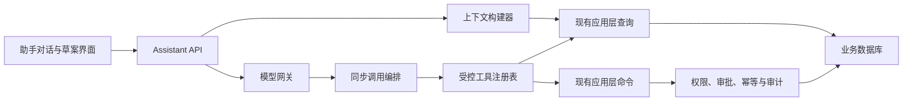

# ShuttleCube 智能运营助手后续开发建议

## 1. 文档目的

本文用于指导 ShuttleCube 在现有经营管理系统之上逐步实现智能运营助手。目标不是尽快加入一个通用聊天框，而是让助手建立在真实、可追溯、受业务规则约束的经营数据之上，依次完成“读懂经营情况、生成操作草案、经确认执行低风险操作”。

本文可作为新功能对话的初始需求。正式开发前仍应先检查当前代码、规格和数据库状态，并形成独立的功能规格、实施计划与任务清单。

## 2. 当前项目基础

当前项目已经具备实现智能助手所需的大部分底层业务事实和约束：

- 统一排期、场地/教练/学员冲突校验和场馆营业时间规则；
- 固定班、课程实例、报名、考勤、课时流水和补课记录；
- 学员档案、固定班权益和私教课包权益；
- 私教预约、履约扣课和逐笔教练费用；
- 散客订场、临时活动和对应排期；
- 应收、分次收款、欠费、退款、支出和付款凭证；
- 教练费用逐笔记录、按教练和自然月全量结算；
- 工作台、经营报表、场地利用率和完整操作审计；
- React 管理端、FastAPI 模块化单体、应用层命令/查询、PostgreSQL 服务端模式和 SQLite 桌面模式。

当前 AI 功能仍只是静态占位，不存在模型调用、Agent API、工具注册、会话存储、后台任务或审批流程。业务系统在没有 AI 配置时必须继续完整运行。

## 3. 产品定位与不变原则

智能运营助手应被定位为“场馆内部经营副驾驶”，而不是独立业务系统或能够绕过后台规则的自动操作员。

以下原则不得因阶段升级而改变：

1. 助手只能调用经过注册的应用层查询和命令，不得直接访问数据库、任意 SQL、Shell、文件系统或任意外部 URL。
2. FastAPI 业务后端继续负责权限、状态、金额、冲突、事务、幂等和审计，并拥有最终裁决权。
3. 助手给出的金额、人数、课时、欠费、利用率和结算结果必须来自工具返回，不允许模型自行计算或补造事实。
4. 每个结论应能追溯到具体业务名称、统计口径、时间范围和原始记录入口。
5. 经营收入沿用当前收付实现口径；欠费表示当前累计未收余额；教练结算以教练和自然月为边界；课时余额以有效流水为准。
6. AI 功能必须由功能开关控制；模型不可用、密钥缺失或网络中断不得影响现有业务页面。
7. 发送给外部模型的数据遵循最小化原则，默认不发送电话号码、凭证图片、请求密钥等非必要敏感数据。

## 4. 建议的三阶段路线

### 阶段一：只读运营助手

目标是让管理人员用自然语言查询经营状态，并获得有依据的提醒和解释。此阶段所有工具必须是只读查询，调用助手不得产生任何业务写入。

首批能力建议按以下顺序实现：

1. 每日运营简报
   - 今日固定班、私教、订场和活动安排；
   - 待考勤课程、剩余课时异常、即将结束的固定班；
   - 当前欠费、当月新增欠费及需要优先跟进的业务；
   - 本月教练待结费用和已结情况；
   - 当日或本月收入、退款、支出和收付利润。
2. 运营待办查询
   - “今天还有哪些课没考勤？”
   - “哪些学员有欠费？”
   - “陈教练 8 月还有多少费用没结？”
   - “哪些学员仍有剩余课时或权益即将耗尽？”
3. 经营分析与异常解释
   - 收入、欠费、退款、支出趋势及变化来源；
   - 场地利用率过低或时段分布异常；
   - 固定班实收下降、欠费集中、班级即将结束；
   - 教练费用与收入变化的业务来源解释。
4. 可追溯结果
   - 回答中展示统计时间、口径和记录数量；
   - 提供跳转到应收、学员、排期、结算或审计页面的业务链接；
   - 对数据不足明确回答“无法判断”，不得猜测原因。

阶段一不应实现自动提醒、后台定时简报、业务写入或多步骤工作流。每日简报先由用户主动打开或提问触发。

### 阶段二：操作草案助手

目标是根据只读工具返回的数据生成可编辑方案，但不自动保存业务记录。

建议能力包括：

- 欠费跟进计划：按金额、账龄、业务类型和学员整理优先级，生成内部跟进清单及沟通文案草稿；
- 排期方案：根据空闲场地、教练、学员、营业时间和现有冲突生成一个或多个候选时段；
- 教练结算预览：解释某教练某自然月应纳入的费用明细、合计和异常项，但不确认结算；
- 经营周报/月报：生成带数据出处的收入、退款、支出、欠费、利用率和教练成本摘要；
- 班级运营建议：识别即将结束、出勤异常、剩余权益偏低或欠费集中的班级；
- 表单预填：将选定草案带入现有创建或编辑表单，由用户在原业务页面检查并保存。

草案必须与业务事实明确分离。建议使用“草案卡片 + 数据依据 + 采用/修改/放弃”交互，首版不需要建立通用工作流编辑器。排期草案在生成和用户采用时都应重新执行冲突检查，避免草案生成后数据发生变化。

### 阶段三：受控执行助手

目标是在用户明确确认后调用已有应用层命令完成有限业务操作。应先从可撤销、影响范围明确、没有资金或权益后果的操作开始。

建议分级：

- 低风险：创建内部跟进提醒、保存经营报告、添加不影响结算的业务备注。只有在项目先补齐相应业务实体和人工编辑入口后，才允许助手执行。
- 中风险：创建新的未履约排期、创建客户档案或业务草稿。每次执行前展示完整字段、影响资源和冲突检查结果，并要求一次明确确认。
- 高风险：登记收款、退款、取消或改期、课时调整、权益终止、费用调整或作废、工资结算、删除业务记录。必须使用独立审批卡片，逐项展示金额/课时/资源影响、原因和幂等键；不得通过一次“全部同意”批量放行不同高风险动作。

任何写操作都必须记录发起人、确认人、模型建议、工具参数、执行结果、请求编号和关联业务审计。确认后如果业务版本或状态已经变化，应拒绝执行并要求重新生成预览。

## 5. 最小技术架构

首版建议继续使用现有 React + FastAPI 模块化单体，采用同步请求完成一次对话和工具调用。

建议新增的核心模块：

- `model_gateway`：屏蔽具体模型供应商，统一超时、重试、结构化输出、用量和错误处理；
- `assistant_context`：按用户问题获取结构化经营快照，不抓取前端页面文本；
- `tool_registry`：登记工具名称、用途、输入/输出 Schema、风险等级、权限、是否需要确认和处理函数；
- `assistant_service`：控制单轮模型调用、最大工具次数、上下文大小、结果引用和错误降级；
- `approval_policy`：阶段三判断风险、生成确认摘要并校验确认后的参数和数据版本；
- `assistant_audit`：记录模型、工具、确认和执行链路，但不得替代现有业务审计。

前端建议采用独立的助手工作区，支持对话、引用卡片、草案卡片、确认卡片和业务页面跳转。不要在首版加入流程画布、代码编辑器或复杂 Agent 监控台。

## 6. 首批受控工具建议

| 工具 | 阶段 | 风险 | 说明 |
|---|---:|---:|---|
| `get_daily_operations_brief` | 1 | 只读 | 聚合今日安排和待办 |
| `list_outstanding_receivables` | 1 | 只读 | 按金额、业务、学员和账龄查询欠费 |
| `list_pending_attendance` | 1 | 只读 | 查询应考勤但未完成的课程 |
| `list_pending_makeups` | 1 | 只读 | 查询待安排或待完成补课 |
| `get_coach_monthly_settlement_preview` | 1 | 只读 | 返回自然月全部待结费用及合计 |
| `get_operations_report` | 1 | 只读 | 使用当前经营报表口径 |
| `get_schedule_availability` | 1/2 | 只读 | 返回场地、教练和学员可用性 |
| `draft_collection_plan` | 2 | 草案 | 生成欠费跟进清单，不写业务 |
| `draft_schedule_options` | 2 | 草案 | 生成候选排期并附冲突依据 |
| `draft_operations_report` | 2 | 草案 | 生成周报或月报文本 |
| `prefill_business_form` | 2 | 草案 | 将参数带入现有表单，不保存 |
| `create_internal_followup` | 3 | 低风险写 | 需先实现内部跟进业务模块 |
| 收退款、取消改期、课时、作废、结算类命令 | 3 | 高风险写 | 独立审批后调用现有命令 |

不要提供 `execute_sql`、`run_shell`、任意 HTTP 请求、任意文件读写或直接修改模型上下文的通用工具。

## 7. 数据与上下文策略

首版不建议把结构化经营数据做成向量 RAG。排期、金额、课时、结算和状态必须通过实时查询工具获取。RAG 只适合后续接入场馆制度、退款政策、教练合同、培训说明等非结构化文档。

建议先增加面向助手的聚合查询，而不是让模型组合大量底层接口。例如：

- `AssistantDailySnapshotQuery`：今日安排、待考勤、欠费、补课、结算和月度摘要；
- `ReceivableFollowupQuery`：欠费业务名称、金额、发生时间、已收、退款和关联人员；
- `ScheduleAvailabilityQuery`：候选时间范围内的场地、教练、学员和冲突；
- `CoachSettlementPreviewQuery`：教练、自然月、逐笔费用和是否已结算；
- `OperationsAnomalyQuery`：当前值、对比期、变化来源和样本数量。

所有工具输出应优先返回可识别的中文业务名称，同时保留内部 ID 供后续工具调用，但不要把 UUID 作为用户主要展示内容。

## 8. 最小数据模型

不要首版直接实现现有未来附录中的全部 AgentDefinition、Workflow、Run、Step、Event、Artifact 和 Budget 表。建议按阶段最小增加：

阶段一：

- `assistant_conversations`：会话、发起人、标题、状态和时间；
- `assistant_messages`：角色、正文、模型信息、用量和时间；
- `assistant_tool_calls`：工具、只读参数、结果摘要、耗时、状态和请求编号。

阶段二可增加草案记录或将草案作为消息中的结构化内容保存。阶段三再增加 `assistant_approvals`，记录风险、待确认参数快照、业务版本、确认人、确认时间和执行结果。

原始业务事实仍只保存在现有领域表中，助手表不得复制形成第二套余额、应收、排期或结算状态。

## 9. 安全与可靠性要求

- 复用当前登录会话、CSRF 和业务权限，不信任模型声称的用户身份；
- 工具参数使用严格 Schema，拒绝未知字段、越界日期、负金额和超长文本；
- 每轮限制模型调用次数、工具调用次数、时间和费用；
- 工具输出视为不可信输入，防止业务备注中的提示注入改变系统策略；
- 模型不得决定自己的权限、风险等级或是否跳过审批；
- 所有写工具必须支持幂等键和并发版本检查；
- 日志中隐藏模型密钥、会话 Cookie、电话号码和凭证地址；
- 模型失败时返回可理解的降级信息，不允许静默执行部分操作；
- 外部模型供应商、数据区域、保留策略和敏感信息处理必须可配置并明确告知管理员。

## 10. 测试与验收指标

阶段一至少满足：

- 关键金额、课时、人数和结算数据与现有查询结果 100% 一致；
- 只读对话前后业务表无写入；
- 每个经营结论都包含时间范围、口径或业务引用；
- 数据不足、记录已删除或工具失败时不编造答案；
- 常见问题集覆盖欠费、考勤、补课、结算、排期和经营报表；
- 提示注入、越权工具、任意 SQL/URL/文件访问全部被拒绝。

阶段二至少满足：

- 草案生成不修改业务数据；
- 排期草案的全部候选项通过现有冲突检查；
- 结算预览与服务端自然月全量规则一致；
- 周报中的数值均能追溯到工具返回。

阶段三至少满足：

- 未确认、确认过期、参数变化或业务版本变化时均不得执行；
- 每次确认只执行对应的一次幂等命令；
- 高风险操作形成独立审批和现有业务审计；
- 模型无法通过提示修改工具风险等级或审批要求。

建议建立固定中文评测集，既包含正常问题，也包含模糊时间、缺失数据、越权请求、提示注入和业务冲突。模型升级时运行回归，不只依赖人工试聊。

## 11. 暂不引入的基础设施及升级条件

首版只读和草案阶段不建议引入 LangGraph、Celery、Redis、MCP、向量数据库或独立 Agent Worker。

出现以下真实需求后再升级：

- 需要每天自动生成简报、定时催办、失败重试或大量异步任务时，引入任务 Worker；
- 需要跨进程队列、任务锁、限流或短期运行状态时，引入 Redis；
- 单次流程出现多分支、暂停审批、数小时后恢复、补偿步骤或复杂状态回放时，再评估 LangGraph；
- 需要实时展示长任务进度时，再增加 SSE；
- 需要连接微信、日历、邮件或其他外部系统时，再评估专用连接器或 MCP，并单独设计权限和人工确认；
- 需要检索大量制度、合同或知识文档时，再引入 RAG。

不要为可能出现的需求提前部署这些组件。

## 12. 推荐实施顺序

1. 新建独立智能运营助手功能规格，确认首版问题清单、数据口径和明确排除项；
2. 整理并测试助手专用聚合查询，先不接模型；
3. 建立工具注册表、风险分级和只读调用测试；
4. 实现可替换的模型网关和同步 Assistant API；
5. 实现对话、引用和业务跳转界面；
6. 上线每日简报、欠费、待考勤、剩余课时异常、月结预览和经营解释；
7. 建立评测集、用量限制、审计和故障降级；
8. 在只读能力稳定后实现草案卡片和表单预填；
9. 根据实际使用频率决定是否增加定时任务；
10. 最后才设计受控写工具和审批表，不与只读首版同时开发。

## 13. 可扩展方向

在前三阶段稳定后，可按实际经营价值评估：

- 班级满班率、续班风险和学员流失预警；
- 场地闲时识别、时段利用优化和价格建议；
- 教练履约、课时结构、收入贡献和成本分析；
- 学员分层、权益耗尽提醒和续费机会；
- 自动生成经营周报、月报和管理层摘要；
- 内部提醒中心，以及经授权的短信、微信或邮件通知；
- 多门店横向对比和跨店资源协同。

这些能力必须建立在准确的历史数据、明确口径和用户可解释性之上，不应由模型单独做最终经营决策。

## 14. 新对话的执行要求

在新对话中，请先阅读本文以及 `AGENTS.md`、`specs/001-badminton-operations/spec.md`、`plan.md`、`data-model.md` 和 `tasks.md`，检查当前代码与实际接口。先为“阶段一：只读运营助手”形成独立规格和实施方案，明确工具清单、模型网关、最小数据模型、安全边界、评测集和验收标准；方案经确认后再编码。

首轮只实现同步、只读、可追溯能力，不实现定时任务、后台 Worker、LangGraph、Celery、Redis、MCP、RAG、外部通知或任何业务写入。不得直接照搬未来 Agent 数据模型附录中的全部实体。
